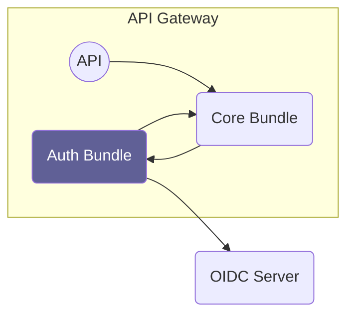

# Overview

Source: https://github.com/digital-blueprint/relay-auth-bundle

The auth bundle connects the core bundle with an OIDC server. For each request
it validates the passed access token, creates a Symfony user and assigns Symfony
roles to that user.

